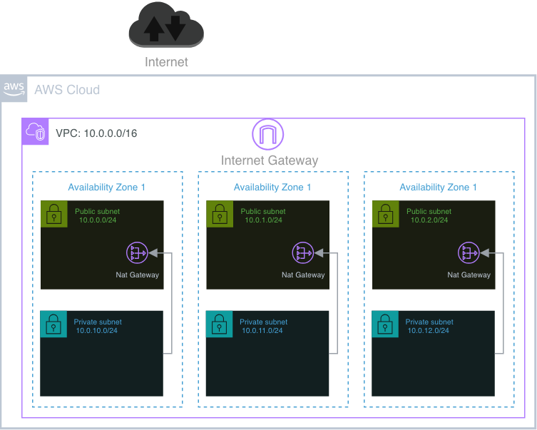
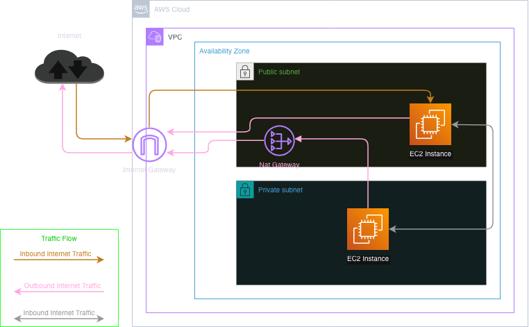

# 02 — VPC

Creates the networking foundation. Everything else in this project runs inside: one VPC, 3 public + 3 private subnets spread across 3 Availability Zones, NAT per AZ, and the routing to tie it together. Every later module (`03_EKS_with_addons` onward) reads this module's state via `data.terraform_remote_state` to get the VPC ID and subnet IDs — nothing downstream creates its own networking.

### VPC with Private and Public Subnets - Architecture


### VPC with Private and Public Subnets - Traffic Flow


## What this creates

| Resource | Count | Notes |
|---|---|---|
| `aws_vpc.main` | 1 | `10.0.0.0/16`, DNS hostnames + DNS support both enabled (required for EKS) |
| `aws_internet_gateway.igw` | 1 | Attached to the VPC, for the public subnets |
| `aws_subnet.public` | 3 | One per AZ, `map_public_ip_on_launch = true` |
| `aws_subnet.private` | 3 | One per AZ, no public IPs |
| `aws_eip.nat` | 3 | One per public subnet — this is a NAT Gateway per AZ |
| `aws_nat_gateway.nat` | 3 | One per public subnet, each private subnet in the same AZ routes through its own AZ's NAT |
| `aws_route_table.public_rt` / `aws_route_table_association.public_rt_assoc` | 3 + 3 | One route table per public subnet, default route → IGW |
| `aws_route_table.private_rt` / `aws_route_table_association.private_rt_assoc` | 3 + 3 | One route table per private subnet, default route → that AZ's own NAT gateway |

**3 NAT Gateways** is a deliberate HA choice (each AZ's private subnet keeps working if another AZ's NAT has an issue) but it's also the most expensive part of this module — 3× NAT Gateway hourly cost + data processing, versus 1 shared NAT. Worth knowing if cost ever needs trimming; the tradeoff is cross-AZ blast radius if a single shared NAT were used instead.

## Availability Zones and CIDR math

- AZs are **not hardcoded** — `data.aws_availability_zones.available` picks whatever 3 AZs are available in the target region, via `slice(..., 0, 3)`. In `us-east-1` today that resolves to `us-east-1a`, `us-east-1b`, `us-east-1c` (confirmed from live output below), but this is *computed at apply time*, not fixed in code.
- Subnet CIDRs are derived from `var.vpc_cidr` (`10.0.0.0/16`) and `var.subnet_newbits` (`8`, i.e. carve out `/24`s):
  - Public subnets: `cidrsubnet(vpc_cidr, 8, 0..2)` → `10.0.0.0/24`, `10.0.1.0/24`, `10.0.2.0/24`
  - Private subnets: `cidrsubnet(vpc_cidr, 8, 10..12)` → `10.0.10.0/24`, `10.0.11.0/24`, `10.0.12.0/24`
  - The `+10` offset between public and private index ranges is just spacing to keep them visually/numerically separated — there's headroom for up to 10 public subnets before the ranges would ever collide.

## Kubernetes / Karpenter subnet tags

Every subnet is tagged for auto-discovery by tools that come later in the stack, even though this module itself has no idea EKS or Karpenter exist yet:

- `kubernetes.io/cluster/retail-gleamgoods-eks = owned` (both public and private) — lets the AWS Load Balancer Controller and the EKS control plane discover these subnets
- `kubernetes.io/role/elb = 1` (public only) — tells the LBC these are valid subnets for internet-facing load balancers
- `kubernetes.io/role/internal-elb = 1` (private only) — same, for internal load balancers
- `karpenter.sh/discovery = retail-gleamgoods-eks` (both) — lets Karpenter's `EC2NodeClass` find these subnets by tag

## Variables

| Name | Default | Notes |
|---|---|---|
| `aws_region` | `us-east-1` | |
| `project_name` | `gleamgoods` | Prefixes every resource `Name` tag (`gleamgoods-vpc`, `gleamgoods-igw`, `gleamgoods-public-us-east-1a`, ...) |
| `vpc_cidr` | `10.0.0.0/16` | |
| `subnet_newbits` | `8` | Controls subnet size — see CIDR math above |
| `tags` | `{Terraform = "true"}` at variable level, but **overridden** by `terraform.tfvars` (see below) | |

`terraform.tfvars` (committed, applies on every plan/apply) overrides `tags` to:
```hcl
tags = {
  Terraform = "true"
  Project   = "GleamGoods"
  Owner     = "Dercio Anselmo"
}
```

## Outputs

- `vpc_id`
- `private_subnet_ids` (list)
- `public_subnet_ids` (list)
- `public_subnet_map` (map of AZ → subnet ID — used where a specific AZ's public subnet needs to be picked deliberately, rather than just any of the three)

## State

Remote, in the bucket from `01_remote_backend_s3bucket`, key `GleamGoods/vpc/terraform.tfstate`.