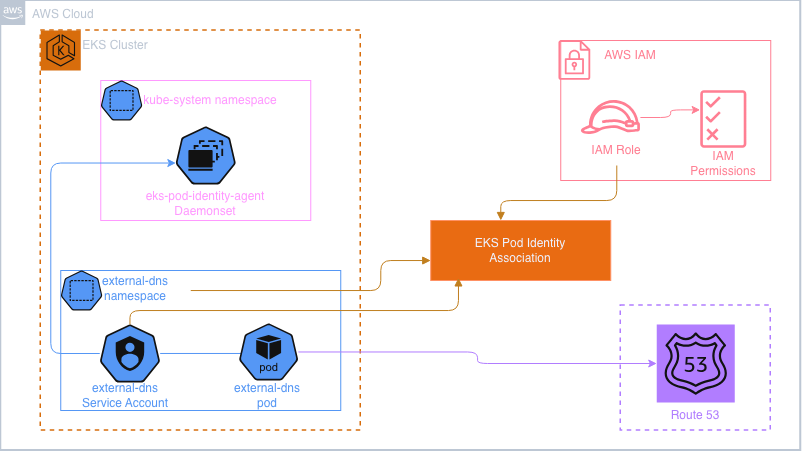

# 03 — EKS with Addons

Creates the Amazon EKS cluster, its initial managed (static) node group, and all cluster-wide controllers and add-ons required by the platform. Other modules rely on this module providing the core Kubernetes foundation, including:

 - EKS Pod Identity
 - AWS Load Balancer Controller
 - Amazon EBS CSI Driver
 - ExternalDNS
 - Secrets Store CSI Driver and AWS provider
 - Metrics-server
 - Reloader

This is the largest module in the project because it is responsible for both provisioning the Kubernetes control plane infrastructure and installing the cluster-level components that enable networking, storage, DNS automation, secrets management, observability integrations, and workload lifecycle management.

This module consumes the VPC infrastructure created by `02_VPC` through data.terraform_remote_state (VPC ID, private subnet IDs, and public subnet IDs).

Its outputs are consumed by downstream modules:

 - `04_EKS_Karpenter` — uses the EKS cluster information to install and configure dynamic node provisioning.
 - `05_OpenTelemetry` — uses cluster connection details and IAM-related outputs for observability components.
 - `08_AWS_managed_databases` — uses cluster/IAM outputs for database-related integrations and workload connectivity.


Currently Live cluster: `retail-gleamgoods-eks`, Kubernetes `1.35`, endpoint `https://********.gr7.us-east-1.eks.amazonaws.com`.

## Cluster core

| Resource | What it does |
|---|---|
| `aws_iam_role.eks_cluster` | Control-plane role, trusts `eks.amazonaws.com`, gets `AmazonEKSClusterPolicy` + `AmazonEKSVPCResourceController` |
| `aws_eks_cluster.main` | The cluster. Control plane ENIs go in the private subnets from `02_VPC`. Logging: all 5 log types enabled (`api`, `audit`, `authenticator`, `controllerManager`, `scheduler`) |
| `aws_ec2_tag.eks_subnet_tag_*` (4 resources) | Tags every VPC subnet `kubernetes.io/cluster/retail-gleamgoods-eks = owned` (both public and private — see note below) plus the ELB role tags. This is a second, cluster-specific layer of tagging on top of what `02_VPC` already applies |
| `aws_iam_role.eks_nodegroup_role` + 3 policy attachments | Node role: `AmazonEKSWorkerNodePolicy`, `AmazonEKS_CNI_Policy`, `AmazonEC2ContainerRegistryReadOnly` |
| `aws_eks_node_group.private_nodes` | The **static** managed node group — `m7i-flex.large`, `ON_DEMAND`, desired 3 / min 1 / max 6, in the private subnets. This coexists with Karpenter (`04_EKS_Karpenter`), which provisions its *own* dynamic nodes separately — this node group is the baseline capacity that exists even if Karpenter isn't running |

**"owned" vs "shared" subnet tags:** In the `c5_eks_tags.tf`, was deliberately changed from `shared` to `owned` on *both* public and private subnets, because Karpenter and the managed node group both need `owned` to launch EC2 instances / attach ENIs — `shared` would only let the control plane use the subnet, not launch workers into it.

**Public endpoint access:** `cluster_endpoint_public_access_cidrs = ["0.0.0.0/0"]` and `cluster_endpoint_private_access = false` — the EKS API server's public endpoint is reachable from the internet, IAM auth is required to actually do anything. 
TODO: Improve the design so it is never reachable from internet, except specific IPs.

**Primary cluster-admin:** `access_config.bootstrap_cluster_creator_admin_permissions = true` — whichever AWS identity's credentials runs the `terraform apply`, automatically have cluster-admin. 

`cluster_authentication_mode` controls how IAM identities can access the EKS cluster. Authentication_mode = "API_AND_CONFIG_MAP" means this project is using both methods:
1. The old way (aws-auth ConfigMap) – still works 
2. The new way (Access Entries API) – future-proof for AWS direction

## Pod Identity
Amazon EKS Pod Identity enables pods in the cluster to securely assume IAM roles without managing static credentials or using IRSA annotations. The high-level flow is shown below, example of external-dns to access Route53



Every Kubernetes addon/controller in this project that requires AWS permissions uses EKS Pod Identity through `aws_eks_pod_identity_association`. Instead of distributing AWS credentials to pods, each controller runs with a dedicated IAM role that is associated with its Kubernetes service account.

The shared IAM trust policy defined in `c13-podidentity-assumerole.tf` allows the EKS Pod Identity service principal: `pods.eks.amazonaws.com` to assume these IAM roles on behalf of workloads running in the cluster.

The aws_eks_addon resource for the EKS Pod Identity Agent is installed first. This agent runs inside the cluster and provides the mechanism that allows pods using associated service accounts to obtain AWS credentials. Any addon or controller configured with `aws_eks_pod_identity_association` depends on this agent being available before it can authenticate with AWS services.


## Addons installed

| Addon / controller | What it does | Install method | Namespace / SA | IAM |
|---|---|---|---|---|
| Pod Identity Agent | Runs on every node; hands out short-lived AWS credentials to pods via Pod Identity associations, so pods can call AWS APIs without static keys | `aws_eks_addon` (`eks-pod-identity-agent`) | — | none needed (it's what makes Pod Identity work) |
| EBS CSI Driver | Lets pods claim EBS-backed `PersistentVolume`s (dynamic provisioning, attach/detach) — needed for anything using a `PersistentVolumeClaim` | `aws_eks_addon` (`aws-ebs-csi-driver`) | `kube-system` / `ebs-csi-controller-sa` | `AmazonEBSCSIDriverPolicy` via Pod Identity |
| ExternalDNS | Watches Ingress/Service objects and automatically creates/updates matching Route53 DNS records — this is what turns an Ingress host into a resolvable domain name | `aws_eks_addon` (`external-dns`) | `external-dns` / `external-dns` | `AmazonRoute53FullAccess` via Pod Identity |
| metrics-server | Collects CPU/memory usage from every pod and node; the source of truth `kubectl top` and every `HorizontalPodAutoscaler` in this project reads from | `aws_eks_addon` (`metrics-server`) | — | none |
| AWS Load Balancer Controller | Watches Ingress/Service objects and provisions real AWS ALBs/NLBs to match — this is what actually creates the load balancer behind `ui`'s | `helm_release` (`aws-load-balancer-controller` chart) | `kube-system` / `aws-load-balancer-controller` | Custom policy — see below |
| Secrets Store CSI Driver | Generic CSI framework for mounting secrets from an external secrets store into pods as a volume; the actual "talk to AWS" part is delegated to the ASCP provider below | `helm_release` (`secrets-store-csi-driver` chart) | `kube-system` | none itself; the ASCP provider below does the AWS calls |
| AWS Secrets & Config Provider (ASCP) | The AWS-specific plugin for the CSI driver above — this is what actually fetches values from Secrets Manager/SSM Parameter Store when a `SecretProviderClass` references them | `helm_release` (`secrets-store-csi-driver-provider-aws` chart) | `kube-system` | uses whatever Pod Identity role the *consuming* pod's service account has (per-app roles live in `08_AWS_managed_databases`) |
| Stakater Reloader | Watches `Secret`/`ConfigMap` objects and rolling-restarts any workload annotated to opt in, whenever the referenced data changes. Specifically using to manage zero downtime for secrets rotation | `helm_release` (`reloader` chart) | `kube-system` | none |

**Addon versions are pinned, not tracking `most_recent`.** To prevent accidental version updates after avery terraform apply,
all 4 addons pull their `addon_version` from a single `var.addon_versions` object (`c2-variables.tf`):

```hcl
variable "addon_versions" {
  default = {
    pod_identity_agent = "v1.3.10-eksbuild.3"
    ebs_csi             = "v1.62.0-eksbuild.1"
    external_dns        = "v0.21.0-eksbuild.6"
    metrics_server       = "v0.8.1-eksbuild.11"
  }
}
```

**LBC's IAM policy is fetched live from GitHub on every plan** (`data "http" "lbc_iam_policy"`, pulling `kubernetes-sigs/aws-load-balancer-controller`'s `main` branch `iam_policy.json` directly).

### Secrets Store CSI Driver — rotation settings

`c16-01` sets three non-default Helm values worth knowing about, since they're load-bearing for the DB-secret rotation set up in `08_AWS_managed_databases`:

- `tokenRequests[0].audience = pods.eks.amazonaws.com` — without this, pods fail to mount CSI secrets at all under Pod Identity.
- `enableSecretRotation = true` + `rotationPollInterval = 2m` — **not on by default.** Without these, `syncSecret.enabled` alone only re-reads the source secret when a pod (re)mounts the volume — a rotated Secrets Manager value would never reach the synced Kubernetes `Secret` (or trigger Reloader) until every consuming pod happened to restart on its own for an unrelated reason.

### Reloader

Reloader watches Kubernetes `Secret` and `ConfigMap` objects. When the data in a referenced Secret or ConfigMap changes, it automatically triggers a rolling restart of any workload annotated with `reloader.stakater.com/auto: true`.

reloader.isArgoRollouts = true is enabled because the orders service (and other services) are deployed as Argo Rollouts `(argoproj.io/Rollout)` rather than standard Kubernetes Deployment resources. With this setting, Reloader knows how to trigger a restart of a Rollout instead of a Deployment.

This closes the loop between AWS Secrets Manager rotating a secret (such as a database password) and the application actually picking up the new value. After the updated secret is synchronized into Kubernetes (for example, by External Secrets Operator), Reloader detects the change and restarts the affected pods so they load the updated secret. See `08_AWS_managed_databases`

## Providers

`c12-helm-and-kubernetes-providers.tf` configures the `helm` and `kubernetes` Terraform providers to authenticate against the EKS cluster created by this module. Authentication uses a short-lived token obtained from `data.aws_eks_cluster_auth`, so each terraform plan or terraform apply retrieves a fresh token, eliminating concerns about stale credentials.

## Variables

Full list in `c2-variables.tf`; the ones actually overridden in `terraform.tfvars` (rest stay at their code defaults):

| Name | Value | Notes |
|---|---|---|
| `cluster_version` | `"1.35"` | Only non-null override — the variable defaults to `null` (AWS default) otherwise |
| `cluster_service_ipv4_cidr` | `172.20.0.0/16` | Kubernetes Service CIDR — separate address space from the VPC's `10.0.0.0/16`, no overlap risk |
| `node_instance_types` | `["m7i-flex.large"]` | |
| `node_capacity_type` | `ON_DEMAND` | This is the managed node group; Karpenter's spot/on-demand choice in `04` is independent |
| `node_desired_size` / `min` / `max` | `3` / `1` / `6` | |
| `cluster_endpoint_public_access_cidrs` | `["0.0.0.0/0"]` | See public endpoint note above |

## Outputs (live values)

```
eks_cluster_name              = retail-gleamgoods-eks
eks_cluster_id                = retail-gleamgoods-eks
eks_cluster_version            = 1.35
eks_cluster_endpoint           = https://********.gr7.us-east-1.eks.amazonaws.com
eks_cluster_security_group_id  = sg-0681ec91bfc0b6ead
private_node_group_name        = retail-gleamgoods-private-ng
eks_node_instance_role_arn     = arn:aws:iam::*******:role/retail-gleamgoods-eks-nodegroup-role
to_configure_kubectl           = aws eks --region us-east-1 update-kubeconfig --name retail-gleamgoods-eks
```

## CI/CD

`.github/workflows/terraform-03-eks-with-addons.yaml` is triggered by pushes to main that modify files under `03_EKS_with_addons/**`. Like the `02_VPC` workflow, it follows a three-stage pipeline:

1. Trivy performs a secret scan.
2. Terraform Plan generates the execution plan and uploads it as the tfplan-03-eks-with-addons artifact.
3. Terraform Apply downloads and applies that exact plan. The apply stage is protected by the GitHub Environment 03-EKS-with-addons-Apply, requiring manual approval before any infrastructure changes are made.

A corresponding terraform-03-eks-with-addons-destroy.yaml workflow provides the equivalent teardown process.


## State

Remote, same backend bucket, key `GleamGoods/eks/terraform.tfstate`.

## Destroy order

This module must be destroyed after `04_EKS_Karpenter`, `05_OpenTelemetry`, and `08_AWS_managed_databases`, as those modules consume outputs from this EKS module. It must be destroyed before `02_VPC`, since this module depends on the VPC outputs exported by that module.