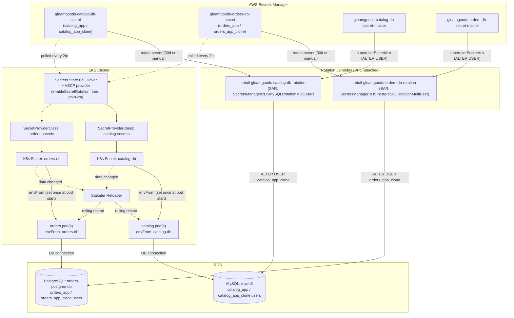

# Secrets Management — Full Architecture

This is the single, cross-cutting reference for how every secret in this project is created, stored, delivered to a running pod, and rotated.

Scope: AWS Secrets Manager secrets, the Kubernetes-side delivery pipeline (Secrets Store CSI Driver + AWS provider + Pod Identity), the rotation Lambdas, and the auto-refresh loop (Reloader).

---

## 1. Inventory — every secret in this project

| Secret | Where it lives | Created by | Rotates? | Consumed by |
|---|---|---|---|---|
| `gleamgoods-db-secret` | AWS Secrets Manager | Manually, out-of-band (not Terraform) | **No** | `08_AWS_managed_databases` (Terraform `data` source only) — sets the RDS **master** username/password on both `catalog_rds` (MySQL) and `orders_postgres` (Postgres) instances |
| `gleamgoods-catalog-db-secret` | AWS Secrets Manager | Terraform (`aws_secretsmanager_secret` container; initial value set manually once) | **Yes** — alternating users, 30-day schedule | Catalog pod, via Secrets Store CSI Driver → K8s Secret `catalog-db` |
| `gleamgoods-catalog-db-secret-master` | AWS Secrets Manager | Terraform (container; value copied from `gleamgoods-db-secret` once) | No (not itself rotated — it's the admin credential the rotation Lambda uses) | Catalog rotation Lambda only, via `superuserSecretArn` |
| `gleamgoods-orders-db-secret` | AWS Secrets Manager | Terraform (container; initial value set manually once) | **Yes** — alternating users, 30-day schedule | Orders pod, via Secrets Store CSI Driver → K8s Secret `orders-db` |
| `gleamgoods-orders-db-secret-master` | AWS Secrets Manager | Terraform (container; value copied from `gleamgoods-db-secret` once) | No | Orders rotation Lambda only, via `superuserSecretArn` |
| `gleamgoods/argocd/admin-password` | AWS Secrets Manager | ArgoCD install script (`07_ArgoCD_Install/01_install-argocd.sh`) | No | Human login to the ArgoCD UI — **not** Terraform-managed, not part of the CSI/rotation system at all |
| GitHub Actions `AWS_ACCESS_KEY_ID` / `AWS_SECRET_ACCESS_KEY` | GitHub repo secrets (not AWS Secrets Manager) | Manually, in GitHub repo settings | No | Every `terraform-*.yaml` CI workflow, to authenticate to AWS. Long-lived static IAM user keys, not OIDC federation — the weakest credential in this whole system (see §7) |
| Redis (checkout's cache) | N/A — no secret exists | — | — | `aws_elasticache_cluster.checkout_redis` has no `auth_token`, no `transit_encryption_enabled`. Access control is network-layer only (security group), not a credential |
| DynamoDB (cart's store) | N/A — no secret exists | — | — | Cart authenticates via IAM (Pod Identity), not a credential — there's nothing to leak because there's nothing issued |
| ALB TLS certificate | AWS Certificate Manager (ACM), not Secrets Manager | Provisioned outside this repo (referenced by ARN in `ui`'s Ingress annotations) | ACM auto-renews | AWS Load Balancer Controller, for the `gleamgoods.dercioanselmo.com` / `argocd.dercioanselmo.com` listeners |

Only **two** secrets in the entire project go through the full rotation + CSI + Reloader machinery described below: `gleamgoods-catalog-db-secret` and `gleamgoods-orders-db-secret`. Everything else in the table is either static, externally managed, or not a credential at all.

---

## 2. End-to-end architecture



Two independent things are happening simultaneously and it's worth keeping them mentally separate:

1. **The rotation loop** (top half): Secrets Manager → Lambda → RDS. This changes the *password in the database* and *the value stored in Secrets Manager*. Nothing in the cluster is involved yet.
2. **The delivery loop** (bottom half): Secrets Manager → CSI driver → K8s Secret → pod env → Reloader restart. This is what makes a *running pod* actually start using the new credential. It runs on its own schedule (a 2-minute poll), independent of when rotation happens.

The gap between these two loops — "the DB password changed" vs. "the pod noticed" — is exactly what makes zero-downtime rotation possible or impossible, and is the subject of most of §4 and §5 below.

---

## 3. How a secret gets from AWS into a container's environment (the delivery pipeline)

This is the mechanical path, step by step, for e.g. `catalog`:

1. **`SecretProviderClass` (`catalog-secrets`)** — a Kubernetes custom resource (from the `secrets-store.csi.x-k8s.io` CRD group) declares: *"fetch the secret named in `app.persistence.secret.secretsManager.secretName` (`gleamgoods-catalog-db-secret`) from Secrets Manager in `us-east-1`, using Pod Identity, and extract its `username`/`password` JSON fields."* It also declares a `secretObjects` block: *"mirror those extracted values into a native Kubernetes `Secret` named `catalog-db`, under keys `RETAIL_CATALOG_PERSISTENCE_USER`/`RETAIL_CATALOG_PERSISTENCE_PASSWORD`."*

2. **The pod's volume mount** — the catalog Deployment/Rollout mounts a CSI volume (`aws-secrets`, driver `secrets-store.csi.k8s.io`) pointing at that `SecretProviderClass`, at `/mnt/secrets-store`. **The app never reads this path directly** — the mount's only real job is to trigger the CSI driver to actually perform the fetch-and-sync (mounting a CSI volume is what invokes the driver's `NodePublishVolume` call, which is when the secret gets fetched). This is a deliberate but easy-to-miss design point: the volume exists to make step 3 happen, not to be read.

3. **Secrets Store CSI Driver + ASCP provider** — the driver receives the mount request, hands it to the AWS-specific provider plugin (ASCP), which:
   - Authenticates as the pod's assigned Pod Identity role (see §4).
   - Calls `secretsmanager:GetSecretValue` for `gleamgoods-catalog-db-secret`.
   - Extracts `username`/`password` via the JMESPath expressions in the `SecretProviderClass`.
   - Writes them to the mounted volume files (unused by the app, but this is what "mounting" means concretely).
   - Because `secretObjects` was declared, it also creates/updates a real Kubernetes `Secret` object (`catalog-db`) with those values — this is `syncSecret.enabled=true` at work.

4. **`envFrom: secretRef: catalog-db`** — the container spec pulls every key in that K8s `Secret` in as environment variables. This happens **once, at container start**. Kubernetes does not live-update a running container's environment when the underlying `Secret` object changes later — this is a hard platform limitation, not a bug in this setup, and it's the reason §5 (Reloader) exists at all.

5. **The app connects to the database** using `RETAIL_CATALOG_PERSISTENCE_USER`/`PASSWORD` from its environment, built into a MySQL DSN by the Go application code.

Orders follows the identical pattern (`orders-secrets` → `orders-db` → `RETAIL_ORDERS_PERSISTENCE_USERNAME`/`PASSWORD`), against PostgreSQL instead of MySQL.

### Keeping the mounted/synced value fresh: `enableSecretRotation`

Step 3 only happens when the volume is mounted (i.e., at pod start) — matching the label "day-1" behavior. Without extra configuration, a password rotated in Secrets Manager on day 15 would sit there unnoticed by the CSI driver until day-1 came around again for some *other* reason (a redeploy, a node replacement). The CSI Driver Helm release (`03_EKS_with_addons/c16-01-secretstorecsi-helm-install.tf`) explicitly turns on:

```hcl
enableSecretRotation = true
rotationPollInterval = "2m"
```

This makes the driver poll every mounted secret every 2 minutes regardless of pod lifecycle, re-fetch it, and re-sync the K8s `Secret` if it changed. **This was not the default and was missing for a period during this project's build-out** — `syncSecret.enabled=true` alone gives no ongoing freshness guarantee at all. Without `enableSecretRotation`, this entire rotation system would still technically "work" (AWS Secrets Manager side), but the cluster would never find out a rotation happened.

---

## 4. IAM / Pod Identity model for secrets access

Every AWS-facing permission in this project uses **EKS Pod Identity** (`aws_eks_pod_identity_association`), not IRSA. For secrets specifically:

- A single trust policy (`c13-podidentity-assumerole.tf`, reused from `03_EKS_with_addons`) lets principal `pods.eks.amazonaws.com` assume any Pod Identity role in the account.
- Two **separate, least-privilege** IAM roles exist, one per service:
  - `retail-gleamgoods-catalog-getsecrets-role`, associated to the `catalog` service account, with `retail-gleamgoods-catalog-db-secret-policy` attached — scoped to `secretsmanager:GetSecretValue` + `DescribeSecret` on `arn:...:secret:gleamgoods-catalog-db-secret*` **only**.
  - `retail-gleamgoods-orders-postgresql-getsecrets-role`, associated to the `orders` service account, with `retail-gleamgoods-orders-db-secret-policy` attached — scoped to `gleamgoods-orders-db-secret*` **only**.
- Neither role can read the other service's secret. Neither role can read the master/superuser secrets — those are only ever read by the rotation Lambdas' own execution roles (auto-created by the SAR CloudFormation stack, scoped to their one `superuserSecretArn`).

This split didn't always exist — until mid-project, both services shared one IAM policy scoped to a single shared secret name pattern (`gleamgoods-db-secret*`), meaning either service's compromised pod could theoretically read the other's DB credential. The per-service split, and the retirement of that legacy shared policy, is covered in `08_AWS_managed_databases`'s history — the policy (`retail-gleamgoods-retailstore-db-secret-policy`) and its two attachments were deleted once both services were confirmed cut over to their own secrets.

---

## 5. Rotation — the DB user model and the Lambdas

### Why two users per service ("alternating users")

The naive rotation approach — generate a new password, change it in the database, update Secrets Manager — has a fatal flaw for this architecture specifically: step 4 of the delivery pipeline above means **already-running pods keep the old password in their environment indefinitely**. If rotation invalidates the old password the instant it runs, any pod that needs a *new* database connection after that moment (connection pool churn, HPA scale-up, a Karpenter spot interruption recycling a node) fails outright until it happens to restart.

The fix used here is AWS's **alternating users** (a.k.a. multi-user) rotation strategy. Each service has two DB accounts:

| Service | Primary user | Clone user |
|---|---|---|
| Catalog (MySQL) | `catalog_app` | `catalog_app_clone` (auto-created by the Lambda, grants cloned from `catalog_app` via `SHOW GRANTS`) |
| Orders (PostgreSQL) | `orders_app` | `orders_app_clone` (auto-created by the Lambda via role-grant cloning) |

On each rotation cycle, the Lambda:
1. Identifies which of the two users is currently **inactive** (not referenced by the secret's `AWSCURRENT` version).
2. Generates a new random password and resets **only that inactive user's** password via `ALTER USER`, authenticating as the master/superuser account (`superuserSecretArn`).
3. Tests the new credential actually works (`testSecret` step).
4. Flips the secret's `AWSCURRENT` label to the newly-reset user (`finishSecret` step).

The password of whichever user a stale pod's environment still references is **never touched during that cycle** — it only gets reset on the *next* rotation, once it's become the inactive one again. That's the entire zero-downtime guarantee: a pod holding a stale credential keeps working until it happens to restart for any reason, and it has a full rotation period (30 days, or until the next manual trigger) to do so before that credential would ever be invalidated.

### Why the RDS master account is never used by the apps

Catalog and Orders never authenticate as the RDS master user. `catalog_app`/`orders_app` (and their clones) are dedicated, least-privilege accounts — created once, manually, with grants scoped to only their own database (`GRANT ALL PRIVILEGES ON catalogdb.*` / ownership-equivalent grants on `ordersdb`). This means:
- A rotation bug can never touch the master credential.
- The master password (`gleamgoods-db-secret`) can stay completely static without that being a security gap for the *application* attack surface — it's only ever used by Terraform (to set the RDS instance's own master credential) and by the two rotation Lambdas (to run `ALTER USER` as an admin).

### The rotation Lambdas themselves

Not custom code — both are AWS's own pre-built applications from the Serverless Application Repository (SAR):
- `retail-gleamgoods-catalog-db-rotation`, from SAR app `SecretsManagerRDSMySQLRotationMultiUser`.
- `retail-gleamgoods-orders-db-rotation`, from SAR app `SecretsManagerRDSPostgreSQLRotationMultiUser`.

Deployed via `aws_serverlessapplicationrepository_cloudformation_stack` (not a Terraform-managed Lambda resource directly — Terraform manages the CloudFormation stack, which manages the Lambda, its execution role, and its Secrets-Manager-invoke permission). Each Lambda:
- Runs inside the VPC (private subnets), because RDS is not publicly accessible — each has its own dedicated security group (`catalog_rotation_lambda_sg` / `orders_rotation_lambda_sg`), and the RDS security groups have an inline ingress rule admitting traffic from that specific Lambda SG only (see the "SG authority conflict" note in `08_AWS_managed_databases` — these had to be inline rules, not standalone `aws_security_group_rule` resources, or Terraform would silently revoke them on unrelated changes).
- Reads its `superuserSecretArn` parameter pointing at its own service's `*-master` secret (not the shared `gleamgoods-db-secret` directly — see below for why).
- Is on a 30-day `automatically_after_days` schedule, with `rotate_immediately = false` so creating/updating the Terraform resource never force-triggers a rotation as a side effect.

**Why per-service master secrets exist at all (`*-secret-master`):** the multi-user rotation Lambda's `setSecret` step needs to open its *own* connection to the database as the master user, which means the master secret it's given needs a `host`/`port`/`dbname`/`engine` field, not just `username`/`password`. The original `gleamgoods-db-secret` only ever had `username`/`password` (it was written for use as a Terraform `data` source feeding `aws_db_instance.username/password`, which doesn't need those extra fields). Since `gleamgoods-db-secret`'s one set of credentials happens to be valid on *both* the MySQL and Postgres instances, and each engine needs its own `host`, a single secret couldn't serve both — hence one host-qualified master secret per service, each holding a **copy** of the same master username/password.

### Password character policy (`excludePunctuation`)

Both rotation Lambdas are configured with `excludePunctuation = "true"`. This was **not** the default and was the cause of a real production incident during this project: AWS's default password generator excludes only `/@"'\` — it does *not* exclude other punctuation (`%`, `>`, `<`, `#`, etc.) that can break naive DSN/connection-string construction in application code. A Lambda-generated password containing `%` and `>` for `catalog_app_clone` caused the catalog service to crash-loop with `Access denied` errors immediately after a rotation, even though the credential itself was correct — the Go MySQL driver's connection string parsing choked on the punctuation. `excludePunctuation = "true"` makes every future generated password alphanumeric-only, matching how the original `catalog_app`/`orders_app` passwords were generated by hand, eliminating this entire class of failure.

### Networking gotcha: inline SG rules, not standalone resources

The RDS security groups (`rds_mysql_sg`, `rds_postgresql_sg`) already manage their ingress rules via inline `ingress {}` blocks (for the EKS cluster's access). Terraform's classic `aws_security_group` resource treats itself as the sole source of truth for a security group's rules the moment it has *any* inline block — mixing that with a separate `aws_security_group_rule` resource for the same group causes Terraform to revoke the separately-managed rule on the next unrelated apply. The rotation Lambda's ingress rules had to be added as additional inline blocks in the same resource (not separate resources), and the state had to be surgically migrated (`terraform state rm` on the old standalone rule resources, without an AWS API call) to avoid a live outage window during the fix.

---

## 6. Testing rotation manually

```bash
# Trigger a rotation immediately, without waiting for the 30-day schedule
aws secretsmanager rotate-secret --secret-id gleamgoods-catalog-db-secret --region us-east-1
aws secretsmanager rotate-secret --secret-id gleamgoods-orders-db-secret --region us-east-1

# Watch which version is AWSCURRENT vs AWSPENDING
aws secretsmanager describe-secret --secret-id gleamgoods-catalog-db-secret --region us-east-1 --query VersionIdsToStages

# Watch the active username flip (catalog_app <-> catalog_app_clone)
aws secretsmanager get-secret-value --secret-id gleamgoods-catalog-db-secret --region us-east-1 --query SecretString --output text | jq -r .username

# Watch the Lambda's own execution logs if something looks stuck
aws logs tail /aws/lambda/retail-gleamgoods-catalog-db-rotation --region us-east-1 --follow

# Confirm the CSI driver has synced the new value into the cluster (can lag up to 2 minutes)
kubectl get secret catalog-db -n default -o jsonpath='{.data.RETAIL_CATALOG_PERSISTENCE_USER}' | base64 -d

# Confirm Reloader picked it up
kubectl logs -n kube-system -l app=reloader-reloader --tail=20 | grep catalog-db
```

A full manual test performed during this project (both secrets, triggered back-to-back) completed with **zero dropped requests** across ~30 minutes of continuous health-checking against both services — confirming the alternating-user design's core promise in practice, not just in theory.

### Emergency procedure: a rotated password is broken (e.g. crash-looping pods)

This happened once (the `excludePunctuation` incident above) and is worth having as a documented runbook rather than rediscovering it under pressure:

1. Confirm it's actually a credential problem: `kubectl logs <pod>` — look for an explicit DB auth error, not a generic connection timeout.
2. Get a client pod onto the DB using the **currently synced** K8s Secret to confirm whether the credential Secrets Manager/K8s currently has actually works (rules out a sync-lag false alarm):
   ```bash
   kubectl run db-diag --rm -it --image=mysql:8.0 --restart=Never \
     --overrides='{"spec":{"containers":[{"name":"db-diag","image":"mysql:8.0","command":["sleep","300"],
     "env":[{"name":"MYSQL_USER","valueFrom":{"secretKeyRef":{"name":"catalog-db","key":"RETAIL_CATALOG_PERSISTENCE_USER"}}},
            {"name":"MYSQL_PASSWORD","valueFrom":{"secretKeyRef":{"name":"catalog-db","key":"RETAIL_CATALOG_PERSISTENCE_PASSWORD"}}}]}]}}' \
     -- sh
   ```
3. If the credential genuinely doesn't work, reset it directly: connect as master, `ALTER USER '<user>'@'%' IDENTIFIED BY '<new-alphanumeric-password>';`, then `aws secretsmanager put-secret-value` with the matching JSON (same `username`/`engine`/`host`/`port`/`dbname`/`masterarn`, only `password` changed) so Secrets Manager and the database agree again.
4. Wait for the CSI driver's next poll (≤2 min) and Reloader to restart the affected pods, or force it with `kubectl delete pod <pod>` to skip the wait.
5. Fix the root cause so it can't recur (in this project's case: setting `excludePunctuation = "true"` on the Lambda) — a manual reset alone only fixes the symptom until the next automatic rotation regenerates a bad password again.

---

## 7. Known gaps / not yet done

Being explicit about what this system does *not* cover, so it isn't mistaken for more complete than it is:

- **`gleamgoods-db-secret` (the RDS master credential) has never been rotated**, and has no rotation configured. It's low-exposure (only Terraform and the two rotation Lambdas ever read it, never an application), but it is the master account for two databases and it's static forever unless someone does this by hand.
- **`gleamgoods/argocd/admin-password` is not Terraform-managed** — created by a shell script, never rotated, not part of any of the machinery above.
- **GitHub Actions authenticates to AWS with long-lived static IAM user keys** (`AWS_ACCESS_KEY_ID`/`AWS_SECRET_ACCESS_KEY` as repo secrets), not OIDC federation. Every other cross-service trust relationship in this project uses short-lived credentials (Pod Identity); CI is the one place that doesn't.
- **Checkout's Redis has no AUTH token and no encryption in transit** — access control is security-group-only.
- **The DevOps repo and the application repo are split** (`GleamGoods-DevOps` vs `GleamGoods`) — the Terraform that creates the secrets lives here, but the `SecretProviderClass`/Helm values that reference them by name live in the separate app repo (`src/catalog/chart`, `src/orders/chart`). Renaming a secret requires a coordinated change across both repos; there's no automated check that they agree with each other.
- **Cart and Checkout were never brought under Secrets Manager** — not a gap exactly (cart genuinely doesn't need a credential, since DynamoDB access is IAM-only), but worth stating plainly rather than leaving it implicit.

---

## 8. Where the underlying Terraform lives

| Concern | File(s) |
|---|---|
| App secrets (containers only, value set manually) | `08_AWS_managed_databases/c10_01_rotation_secrets.tf` |
| Master/superuser secrets | Same file |
| Rotation Lambda networking (SGs) | `08_AWS_managed_databases/c10_02_rotation_lambda_networking.tf`, inline blocks in `c6_01`/`c9_01` |
| Rotation Lambdas (SAR stacks) | `08_AWS_managed_databases/c10_03_rotation_lambdas.tf` |
| Rotation schedule | `08_AWS_managed_databases/c10_04_rotation_config.tf` |
| Per-service IAM policies | `08_AWS_managed_databases/c10_05_new_per_service_iam_policies.tf` |
| Pod Identity roles/associations (catalog, orders) | `08_AWS_managed_databases/c6_05`–`c6_06`, `c9_04`–`c9_05` |
| Secrets Store CSI Driver + rotation polling | `03_EKS_with_addons/c16-01-secretstorecsi-helm-install.tf` |
| ASCP (AWS provider for the CSI driver) | `03_EKS_with_addons/c16-02-secretstorecsi-ascp-helm-install.tf` |
| Reloader | `03_EKS_with_addons/c19-01-reloader-helm-install.tf` |
| `SecretProviderClass` / K8s Secret mapping (per service) | App repo: `src/catalog/chart/templates/secretproviderclass.yaml`, `src/orders/chart/templates/secretproviderclass.yaml` |
| Reloader annotation + `envFrom` wiring | App repo: `src/catalog/chart/templates/deployment.yaml`, `src/orders/chart/templates/rollout.yaml` |
