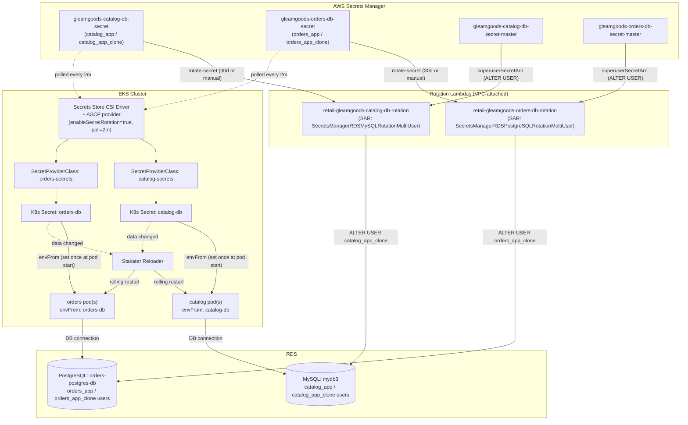

# Secrets Management — Full Architecture

This is the single, cross-cutting reference for how every secret in this project is created, stored, delivered to a running pod, and rotated.

It focuses on secrets managed in AWS Secrets Manager — how they are created, synchronized into Kubernetes, consumed by applications, and rotated over time. It also covers the Kubernetes-side delivery mechanism (Secrets Store CSI Driver, AWS Provider, EKS Pod Identity, and Reloader).

---

## 1. Inventory

| Secret | Where it lives | Created by | Rotates? | Consumed by |
|---|---|---|---|---|
| `gleamgoods-catalog-db-secret` | AWS Secrets Manager | Terraform (`aws_secretsmanager_secret` container; initial value set manually once) | **Yes** — alternating users, 30-day schedule | Catalog pod, via Secrets Store CSI Driver → K8s Secret `catalog-db` |
| `gleamgoods-catalog-db-secret-master` | AWS Secrets Manager | Terraform (container; value copied from `gleamgoods-db-secret` once) | No (not itself rotated — it's the admin credential the rotation Lambda uses) | Catalog rotation Lambda only, via `superuserSecretArn` |
| `gleamgoods-orders-db-secret` | AWS Secrets Manager | Terraform (container; initial value set manually once) | **Yes** — alternating users, 30-day schedule | Orders pod, via Secrets Store CSI Driver → K8s Secret `orders-db` |
| `gleamgoods-orders-db-secret-master` | AWS Secrets Manager | Terraform (container; value copied from `gleamgoods-db-secret` once) | No | Orders rotation Lambda only, via `superuserSecretArn` |


---

## 2. End-to-end architecture



Two independent processes are happening simultaneously, and it's important to keep them conceptually separate:

1. The rotation loop (top half): **Secrets Manager → Lambda → RDS**. This process rotates the database credentials by updating both the password stored in the database and the corresponding secret in AWS Secrets Manager. At this stage, nothing inside the Kubernetes cluster has changed.
2. The delivery loop (bottom half): **Secrets Manager → Secrets Store CSI Driver → Kubernetes Secret → Pod environment → Reloader restart**. This process propagates the updated secret into the cluster and ultimately causes application pods to restart so they begin using the new credential. It runs independently of the rotation process, polling for secret changes approximately every two minutes.

These two processes are intentionally independent, which means there is a period where the database has already switched to the new credential while some pods have not. Sections 4 and 5 explain how the project manages that transition so applications continue running normally.

---

## 3. How a secret gets from AWS into a container's environment (the delivery pipeline)

This is the mechanical path, step by step, for e.g. `catalog`:

1. **`SecretProviderClass` (`catalog-secrets`)** — A Kubernetes custom resource (CRD `secrets-store.csi.x-k8s.io`) that defines how secrets should be retrieved from AWS Secrets Manager. It instructs the Secrets Store CSI Driver to fetch the secret whose name is configured in app.persistence.secret.secretsManager.secretName (for example, `gleamgoods-catalog-db-secret`) using EKS Pod Identity, and extract the username and password fields from the secret's JSON payload.

    The resource also defines a `secretObjects` section, which tells the CSI Driver to mirror those extracted values into a native Kubernetes Secret named `catalog-db`. The values are stored under the keys `RETAIL_CATALOG_PERSISTENCE_USER` and `RETAIL_CATALOG_PERSISTENCE_PASSWORD`, allowing the application to consume them like any other Kubernetes Secret.

2. **The pod's CSI volume mount** — The catalog Deployment/Rollout mounts a CSI volume (aws-secrets, driver secrets-store.csi.k8s.io) that references the SecretProviderClass, mounting it at /mnt/secrets-store.

    Although the application never reads files from `/mnt/secrets-store`, the volume mount is still required. Mounting the CSI volume causes Kubernetes to invoke the CSI driver's `NodePublishVolume` operation, which is when the Secrets Store CSI Driver authenticates with AWS (via EKS Pod Identity), fetches the secret from Secrets Manager, and processes the associated `SecretProviderClass`.

    Because the `SecretProviderClass` includes a secretObjects section, the fetched values are also synchronized into the native Kubernetes Secret (catalog-db). The application consumes that Kubernetes Secret as environment variables rather than reading the mounted files directly.

    This is an intentional design choice: the CSI volume is present to activate the Secrets Store CSI Driver and keep the Kubernetes Secret synchronized with AWS Secrets Manager, while the application continues to use the familiar Kubernetes Secret interface.


3. **Secrets Store CSI Driver + AWS Secrets & Configuration Provider (ASCP)** — When the CSI volume is mounted, the Secrets Store CSI Driver receives the mount request and delegates the AWS-specific work to the AWS Secrets & Configuration Provider (ASCP). Together, they perform the following steps:

 - Authenticate to AWS using the pod's assigned EKS Pod Identity IAM role.
 - Call `secretsmanager:GetSecretValue` to retrieve `gleamgoods-catalog-db-secret`.
 - Extract the username and password fields using the JMESPath expressions defined in the `SecretProviderClass`.
 - Write the extracted values to files under the mounted CSI volume (these files are not used by the application, but they are the driver's primary output).
 - Because the SecretProviderClass defines a secretObjects section, the Secrets Store CSI Driver also synchronizes those values into a native Kubernetes Secret (`catalog-db`). This synchronization is enabled by syncSecret.enabled=true, allowing the application to consume the secret through the standard Kubernetes Secret interface, instead of reading the mounted files directly.


4. **`envFrom: secretRef: catalog-db`** — The container specification imports all key/value pairs from the Kubernetes Secret object catalog-db as environment variables inside the container.

    This injection happens only during container creation. Kubernetes reads the Secret value when the container starts and sets the corresponding environment variables in the container process. If the underlying Kubernetes Secret object is updated later, Kubernetes does not modify the environment variables of an already-running container. This is expected Kubernetes behavior, not a limitation or bug in this setup.

    This is the reason Reloader is required in section 5: when the synchronized Kubernetes Secret changes, Reloader detects the change and triggers a rollout restart, causing new pods to start with the updated secret values.


### Keeping the mounted/synced value fresh: `enableSecretRotation`

The initial secret retrieval happens when the CSI volume is mounted (normally during pod creation). This represents the "day-1" behavior: the pod starts, the Secrets Store CSI Driver fetches the value from AWS Secrets Manager, and the secret is mounted/synchronized into Kubernetes.

The Secrets Store CSI Driver Helm release (`03_EKS_with_addons/c16-01-secretstorecsi-helm-install.tf`) explicitly enables continuous rotation polling:

```bash
enableSecretRotation = true
rotationPollInterval = "2m"
```

With this enabled, the CSI Driver periodically checks mounted secrets every two minutes. If a value has changed in AWS Secrets Manager, the driver re-fetches the secret and updates the mounted secret data. When secretObjects is configured, the updated value is also synchronized into the corresponding Kubernetes Secret.

**Important**: `syncSecret.enabled=true` only controls synchronization into a Kubernetes Secret; it does not provide a mechanism for detecting changes. It does not create a refresh loop by itself.

Without `enableSecretRotation`, the AWS Secrets Manager rotation process would still succeed, but the Kubernetes side would not automatically discover the new credential. The database password would change in AWS/RDS, while workloads inside the cluster could continue running with the old credential until a pod restart caused the secret to be fetched again.

---

## 4. IAM / Pod Identity model for secrets access

Every AWS-facing permission in this project uses EKS Pod Identity (`aws_eks_pod_identity_association`) rather than IRSA. Pod Identity provides the mechanism for Kubernetes workloads to obtain AWS credentials, while IAM roles and policies define the exact permissions each workload receives.

For secrets specifically:

 - A shared IAM trust policy (`c13-podidentity-assumerole.tf`, reused from `03_EKS_with_addons`) allows the EKS Pod Identity service principal: `pods.eks.amazonaws.com` to assume the IAM roles associated with Kubernetes service accounts.
 - Two separate, least-privilege IAM roles are created, one per service:
    **Catalog service**
  - IAM role: `retail-gleamgoods-catalog-getsecrets-role`
  - Associated with the catalog Kubernetes service account.
  - Attached policy: `retail-gleamgoods-catalog-db-secret-policy`
  - Permissions: `secretsmanager:GetSecretValue` and `secretsmanager:DescribeSecret`
  - Resource scope: `arn:...:secret:gleamgoods-catalog-db-secret*`
    **Orders service**
  - IAM role: `retail-gleamgoods-orders-postgresql-getsecrets-role`
  - Associated with the orders Kubernetes service account.
  - Attached policy: `retail-gleamgoods-orders-db-secret-policy`
  - Resource scope: `arn:...:secret:gleamgoods-orders-db-secret*`


The **master/superuser** credentials are the administrative account for each RDS instance (similar to the root user in MySQL or the postgres superuser in PostgreSQL). They are never used by the application. Catalog and Orders always connect using their own least-privilege accounts (catalog_app/orders_app and their clones), not the database administrator account.

The only component that needs the master credentials is the AWS Secrets Manager rotation Lambda. During a rotation, the Lambda connects to the database as the administrator so it can run operations such as ALTER USER to reset the password of the inactive application account. Without administrative privileges, it would not be able to rotate another user's password.

Each rotation Lambda has its own IAM execution role, created automatically by the AWS Serverless Application Repository (SAR) CloudFormation stack that deploys the Lambda. That IAM role is granted permission to read only the master secret for the database it manages (its superuserSecretArn). For example, the Catalog rotation Lambda can read only the Catalog master secret, while the Orders rotation Lambda can read only the Orders master secret. Neither Lambda can access the other service's master credentials.

---

## 5. Rotation — the DB user model and the Lambdas

### Why two users per service ("alternating users")

Rotating a database password is easy. Rotating it without breaking applications is the hard part.

The challenge comes from the delivery pipeline described in the previous section. 

This project uses AWS's alternating users (multi-user) rotation strategy:

| Service | Primary user | Clone user |
|---|---|---|
| Catalog (MySQL) | `catalog_app` | `catalog_app_clone` (auto-created by the Lambda, grants cloned from `catalog_app` via `SHOW GRANTS`) |
| Orders (PostgreSQL) | `orders_app` | `orders_app_clone` (auto-created by the Lambda via role-grant cloning) |

On each rotation cycle, the Lambda:
1. Identifies which of the two users is currently **inactive** (not referenced by the secret's `AWSCURRENT` version).
2. Generates a new random password and resets **only that inactive user's** password via `ALTER USER`, authenticating as the master/superuser account (`superuserSecretArn`).
3. Tests the new credential actually works (`testSecret` step).
4. Flips the secret's `AWSCURRENT` label to the newly-reset user (`finishSecret` step).

The key idea is that the password currently being used by running applications is never changed during the current rotation. Instead, the Lambda updates the password of the other database user, verifies that it works, and only then switches Secrets Manager to point applications to that user.

This means existing pods can continue using their current database credentials until they are restarted naturally (for example, during a deployment, node replacement, or autoscaling event). New pods will receive the new credentials, while existing pods continue working with the old ones. The old user's password is not changed until the next rotation cycle, giving every pod up to one full rotation period (30 days, unless rotation is triggered manually sooner) to restart and adopt the new credentials.

### The rotation Lambdas themselves

The lambda functions are AWS's own pre-built applications from the Serverless Application Repository (SAR):
- `retail-gleamgoods-catalog-db-rotation`, from SAR app `SecretsManagerRDSMySQLRotationMultiUser`.
- `retail-gleamgoods-orders-db-rotation`, from SAR app `SecretsManagerRDSPostgreSQLRotationMultiUser`.

Deployed via `aws_serverlessapplicationrepository_cloudformation_stack` (not a Terraform-managed Lambda resource directly — Terraform manages the CloudFormation stack, which manages the Lambda, its execution role, and its Secrets-Manager-invoke permission). Each Lambda:
- Runs inside the VPC (private subnets), because RDS is not publicly accessible — each has its own dedicated security group (`catalog_rotation_lambda_sg` / `orders_rotation_lambda_sg`), and the RDS security groups have an inline ingress rule admitting traffic from that specific Lambda SG only (see the "SG authority conflict" note in `08_AWS_managed_databases` — these had to be inline rules, not standalone `aws_security_group_rule` resources, or Terraform would silently revoke them on unrelated changes).
- Reads its `superuserSecretArn` parameter pointing at its own service's `*-master` secret.
- Is on a 30-day `automatically_after_days` schedule, with `rotate_immediately = false` so creating/updating the Terraform resource never force-triggers a rotation as a side effect.

Each rotation Lambda needs to connect to its database as the administrator in order to reset application user passwords (ALTER USER). To do that, it requires a Secrets Manager secret containing the complete connection information for that specific database instance, including the administrator username, password, host, port, database engine, and database name.

### Password character policy (`excludePunctuation`)

Both rotation Lambdas are configured with excludePunctuation = "true". This ensures generated database passwords contain only alphanumeric characters, avoiding issues with special characters being incorrectly parsed when building database connection strings in the application.

---

## 6. Testing rotation manually

```bash
# Trigger a rotation immediately, without waiting for the 30-day schedule
aws secretsmanager rotate-secret --secret-id gleamgoods-catalog-db-secret --region us-east-1
aws secretsmanager rotate-secret --secret-id gleamgoods-orders-db-secret --region us-east-1

# Watch which version is AWSCURRENT vs AWSPENDING
aws secretsmanager describe-secret --secret-id gleamgoods-catalog-db-secret --region us-east-1 --query VersionIdsToStages

# Watch the active username flip (catalog_app <-> catalog_app_clone)
aws secretsmanager get-secret-value --secret-id gleamgoods-catalog-db-secret --region us-east-1 --query SecretString --output text | jq -r .username

# Watch the Lambda's own execution logs if something looks stuck
aws logs tail /aws/lambda/retail-gleamgoods-catalog-db-rotation --region us-east-1 --follow

# Confirm the CSI driver has synced the new value into the cluster (can lag up to 2 minutes)
kubectl get secret catalog-db -n default -o jsonpath='{.data.RETAIL_CATALOG_PERSISTENCE_USER}' | base64 -d

# Confirm Reloader picked it up
kubectl logs -n kube-system -l app=reloader-reloader --tail=20 | grep catalog-db
```

A full manual test performed during this project (both secrets, triggered back-to-back) completed with **zero dropped requests** across ~30 minutes of continuous health-checking against both services — confirming the alternating-user design's core promise in practice, not just in theory.

### Emergency procedure: a rotated password is broken (e.g. crash-looping pods)

This happened once (the `excludePunctuation` incident above) and is worth having as a documented runbook rather than rediscovering it under pressure:

1. Confirm it's actually a credential problem: `kubectl logs <pod>` — look for an explicit DB auth error, not a generic connection timeout.
2. Get a client pod onto the DB using the **currently synced** K8s Secret to confirm whether the credential Secrets Manager/K8s currently has actually works (rules out a sync-lag false alarm):
   ```bash
   kubectl run db-diag --rm -it --image=mysql:8.0 --restart=Never \
     --overrides='{"spec":{"containers":[{"name":"db-diag","image":"mysql:8.0","command":["sleep","300"],
     "env":[{"name":"MYSQL_USER","valueFrom":{"secretKeyRef":{"name":"catalog-db","key":"RETAIL_CATALOG_PERSISTENCE_USER"}}},
            {"name":"MYSQL_PASSWORD","valueFrom":{"secretKeyRef":{"name":"catalog-db","key":"RETAIL_CATALOG_PERSISTENCE_PASSWORD"}}}]}]}}' \
     -- sh
   ```
3. If the credential genuinely doesn't work, reset it directly: connect as master, `ALTER USER '<user>'@'%' IDENTIFIED BY '<new-alphanumeric-password>';`, then `aws secretsmanager put-secret-value` with the matching JSON (same `username`/`engine`/`host`/`port`/`dbname`/`masterarn`, only `password` changed) so Secrets Manager and the database agree again.
4. Wait for the CSI driver's next poll (≤2 min) and Reloader to restart the affected pods, or force it with `kubectl delete pod <pod>` to skip the wait.
5. Fix the root cause so it can't recur (in this project's case: setting `excludePunctuation = "true"` on the Lambda) — a manual reset alone only fixes the symptom until the next automatic rotation regenerates a bad password again.

---

## 7. Where the underlying Terraform lives

| Concern | File(s) |
|---|---|
| App secrets (containers only, value set manually) | `08_AWS_managed_databases/c10_01_rotation_secrets.tf` |
| Master/superuser secrets | Same file |
| Rotation Lambda networking (SGs) | `08_AWS_managed_databases/c10_02_rotation_lambda_networking.tf`, inline blocks in `c6_01`/`c9_01` |
| Rotation Lambdas (SAR stacks) | `08_AWS_managed_databases/c10_03_rotation_lambdas.tf` |
| Rotation schedule | `08_AWS_managed_databases/c10_04_rotation_config.tf` |
| Per-service IAM policies | `08_AWS_managed_databases/c10_05_new_per_service_iam_policies.tf` |
| Pod Identity roles/associations (catalog, orders) | `08_AWS_managed_databases/c6_05`–`c6_06`, `c9_04`–`c9_05` |
| Secrets Store CSI Driver + rotation polling | `03_EKS_with_addons/c16-01-secretstorecsi-helm-install.tf` |
| ASCP (AWS provider for the CSI driver) | `03_EKS_with_addons/c16-02-secretstorecsi-ascp-helm-install.tf` |
| Reloader | `03_EKS_with_addons/c19-01-reloader-helm-install.tf` |
| `SecretProviderClass` / K8s Secret mapping (per service) | App repo: `src/catalog/chart/templates/secretproviderclass.yaml`, `src/orders/chart/templates/secretproviderclass.yaml` |
| Reloader annotation + `envFrom` wiring | App repo: `src/catalog/chart/templates/deployment.yaml`, `src/orders/chart/templates/rollout.yaml` |
| GitHub Actions → AWS auth for all Terraform CI (OIDC, no static keys) | `01_remote_backend_s3bucket/c5-github-actions-terraform-role.tf` — the one module applied manually, so this role already exists before any other module's CI runs; consumed by every `.github/workflows/terraform-*.yaml` |
